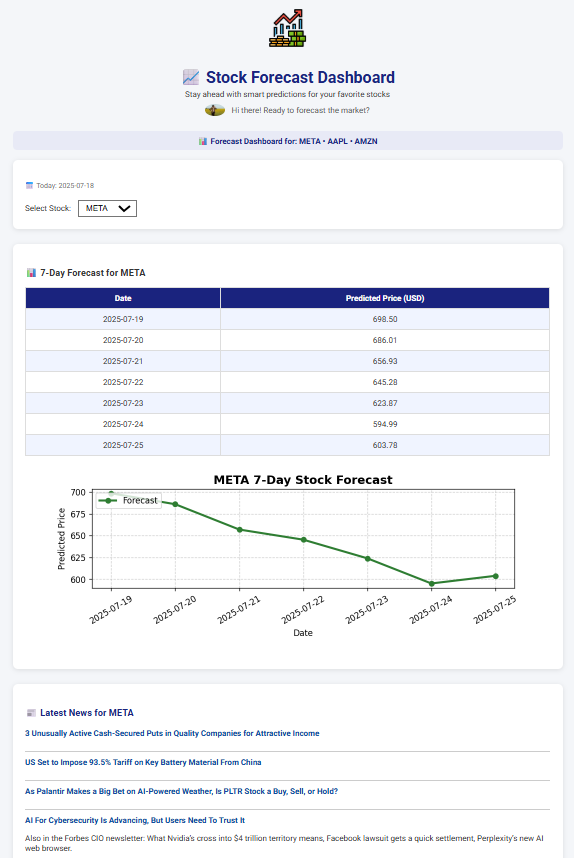

# 📈 Stock Forecast Dashboard

An interactive and visually styled web application built with **Flask** that provides **7-day stock price forecasts** for major tech stocks — **META**, **AAPL**, and **AMZN** — using **XGBoost regression**, **real-time Yahoo Finance data**, and **MySQL** for backend storage. The app also fetches the latest stock news articles from NewsAPI.

---

## 🚀 Features

- 🔄 **Live Data**: Pulls 2 years of historical stock data using `yfinance`.
- 🧠 **XGBoost Model**: Predicts stock prices for the next 7 days.
- 🗄️ **MySQL Storage**: Historical stock data is stored and accessed from a MySQL database.
- 🗓️ **Dynamic Dates**: Automatically updates predictions based on today’s date.
- 📰 **Latest News**: Shows real-time news from [NewsAPI](https://newsapi.org/).
- 🎨 **Stylized UI**: Clean, responsive dashboard layout with animated visuals.
- 📊 **Forecast Visualization**: Generates updated charts using `matplotlib`.

---

## 🖼️ UI Preview



---

## 📦 Tech Stack

| Component    | Description                              |
|--------------|------------------------------------------|
| **Flask**     | Web framework                            |
| **XGBoost**   | Machine learning model                   |
| **MySQL**     | Data storage for stock data              |
| **yfinance**  | Historical stock data retrieval          |
| **NewsAPI**   | Real-time financial news integration     |
| **Matplotlib**| Charting and visual forecasts            |
| **HTML/CSS**  | Front-end layout and animations          |

---

## 💻 Setup Instructions

### 1. Clone the Repository
```bash
git clone https://github.com/Bharathkumar21421/Stock_Anlysis.git
cd Stock_Anlysis
```

### 2. Install Requirements
```bash
pip install -r requirements.txt
```

### 3. Configure MySQL
Update your `config.py` with your MySQL credentials:
```python
MYSQL_CONFIG = {
    'host': 'localhost',
    'user': 'your_username',
    'password': 'your_password',
    'database': 'your_database'
}
```

Create necessary tables (e.g., `meta_stock_data`, `aapl_stock_data`, etc.) using SQL schema if applicable.

---

## 🏃 Run the App
```bash
python app.py
```

Open in your browser:
```
http://localhost:5000
```

---

## 🌍 Deployment

Compatible with:
- [Render](https://render.com/)
- [Heroku](https://heroku.com/)
- [Replit](https://replit.com/)
- Custom VPS or cloud server

Include `Procfile`, `requirements.txt`, and proper MySQL access settings for production.

---

## 🔐 API Key

This app uses [NewsAPI](https://newsapi.org/). Replace the default key in `app.py`:

```python
api_key = "your-newsapi-key"
```

---

## 📝 License

Free for educational and personal use.

---

**Made with ❤️ by Bharath for smarter forecasting**
